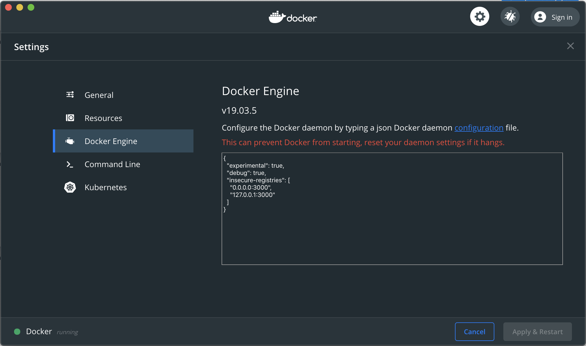

This document describes how to enable the [dependency proxy](https://docs.khulnasoft.com/ee/user/packages/dependency_proxy/)
in your KDK environment.

Some dependency proxy operations require token scopes that are only available when the container registry is enabled. You should
[enable the registry](registry.md#set-up-pushing-and-pulling-of-images-over-http) when developing or testing features related to the dependency proxy.

## Configuration

### Linux

As the dependency proxy is a core feature, it does not require a license to use. The dependency proxy is already enabled and configured by default.

Test it with:

```shell
# Login to the dependency proxy with your KhulnaSoft credentials
sudo docker login 0.0.0.0:3000

# Pull the hello-world image through the dependency proxy and run it
sudo docker run localhost:3000/khulnasoft-org/dependency_proxy/containers/hello-world:latest
```

Docker should succeed and you should see

```shell
Hello from Docker!
This message shows that your installation appears to be working correctly.
```

in the output.

### MacOS

#### Use an IP address with your KDK installation, `localhost` does not work

This can be accomplished by [updating the KDK configuration](../configuration.md) by
creating or updating the `kdk.yml` file in the root of your KDK directory.

The file should contain the intended host, such as `127.0.0.1` or `0.0.0.0`:

```ini
host: 0.0.0.0
```

Run `kdk reconfigure` and `kdk restart` to invoke the changes and visit the IP
(`0.0.0.0:3000`) to check if KhulnaSoft is accessible through the new IP.

#### Reconfigure the Docker daemon

Depending on the Docker daemon you are using, you will need to update your `daemon.json`
to include the dependency proxy as an insecure registry.

##### Colima

The `daemon.json` file is located at:

- MacOS: `~/.colima/default/colima.yaml`

1. Add these values to the file:

   ```yaml
   docker:
     insecure-registries:
      - 0.0.0.0:3000
      - 127.0.0.1:3000
   ```

1. Restart Colima:

   ```shell
   colima restart
   ```

##### Docker

###### Editing directly

The `daemon.json` file is located at:

- MacOS: `~/.docker/daemon.json`
- Linux: `/etc/docker/daemon.json`
- Windows: `C:\ProgramData\docker\config\daemon.json`

1. Add these values to the file:

   ```json
   {
     "experimental": true,
     "insecure-registries": ["0.0.0.0:3000", "127.0.0.1:3000"]
   }
   ```

1. Restart Docker: this will vary depending on how you are running Docker.
   See the specific documentation for your platform (Rancher, Docker Desktop, etc.)

###### Old Docker Desktop for Mac (< 2.2.0.0)

Open Docker -> Preferences, and navigate to the tab labeled **Daemon**.
Check the box to enable **Experimental features** and you can add
a new **Insecure registry**. Click **Apply & Restart**.


###### Docker Desktop for Mac 2.2.0.0+ (newest versions)

Open Docker -> Right click on status bar -> Preferences -> Docker Engine, and type in:

```json
{
  "experimental": true,
  "insecure-registries": ["0.0.0.0:3000", "127.0.0.1:3000"]
}
```



##### Pulling from the dependency proxy

Once your Docker daemon has restarted with the newly configured insecure registry settings, you can test the dependency proxy with:

```shell
# Login to the dependency proxy with your KhulnaSoft credentials
sudo docker login 0.0.0.0:3000

# Pull the hello-world image through the dependency proxy and run it
sudo docker run 0.0.0.0:3000/khulnasoft-org/dependency_proxy/containers/hello-world:latest
```

Docker should succeed and you should see the following:

```shell
Hello from Docker!
This message shows that your installation appears to be working correctly.
```

## Object storage

When using [object storage](object_storage.md), two additional steps must be taken.

1. The object storage host must be the same as the Dependency Proxy host. If you used
   `0.0.0.0` as described above, you must include that as the object storage host in the
   `kdk.yml` file:

   ```yaml
   object_store:
     enabled: true
     host: 0.0.0.0
   ```

1. The object storage domain must be added to the `insecure-registries` list in the
[configuration](#configuration) section. For example:

   ```json
   {
     "experimental": true,
     "insecure-registries": ["0.0.0.0:3000", "0.0.0.0:9000"]
   }
   ```
